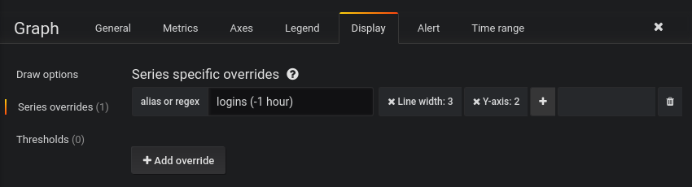
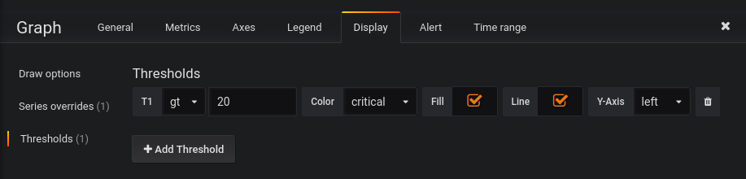
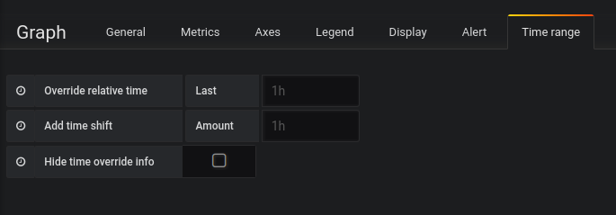
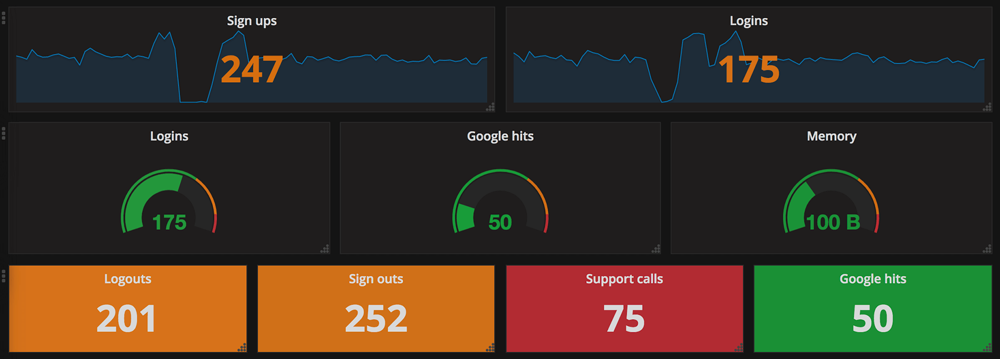
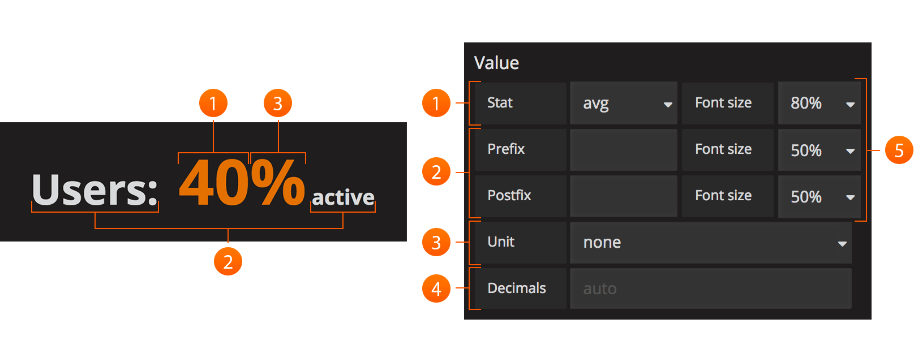

# Graph Panel

 

Grafana的主要面板简称为Graph。 它提供了一组非常丰富的图形选项。

1. 单击面板的标题会显示一个菜单。 `edit`选项可打开面板的其他配置选项。
2. 单击以打开颜色和轴选择。
3. 单击此处仅显示此系列。 Shift / Ctrl +单击以隐藏系列。

## General

 

### Info

- **Title** - 仪表板的面板标题显示在顶部。
- **Description** - 面板描述，显示在面板左上角的信息图标悬停上。
- **Transparent** - 如果选中，则删除面板的纯色背景（默认未选中）。

### Repeat

为变量的每个值重复一个面板。

### Drilldown / detail link

深入部分允许向面板添加动态链接，该链接可以链接到其他仪表板或URL。

每个链接都有标题，类型和参数。 链接可以是`仪表板`或`绝对`链接。 如果是仪表板链接，则`仪表板`值必须是仪表板的名称。 如果它是`绝对`链接，则URL是链接的URL。


## Metrics

metrics选项卡定义要呈现的系列数据和源。 每个数据源都提供不同的选项。

## Axes

 

“轴”选项卡控制轴的显示。

### Left Y/Right Y

可以使用以下方法自定义**左Y**和**右Y**：

- **Unit** - 显示单位为Y值
- **Scale** - 用于Y值的比例，线性或对数。（默认线性）
- **Y-Min** - 最小Y值。（默认自动）
- **Y-Max** - 最大Y值。（默认自动）
- **Decimals** - 控制Y值显示的小数位数（默认自动）
- **Label** - Y轴标签（默认为“”）

也可以通过取消选中Show中的相应框来隐藏轴。

### X-Axis

通过取消选中Show可以隐藏轴。

对于**Mode**，有三种选择：

- 默认选项是时间，表示x轴表示时间，数据按时间分组（例如，按小时或分钟）。
- “系列”选项表示数据按序列分组，而不是按时间分组。 y轴仍代表该值。
    
- 直方图选项将图形转换为直方图。 直方图是一种条形图，它将数字分组到范围内，通常称为桶或箱。 较高的条形图显示更多数据属于该范围。 


### Y-Axes

- **Align** - 检查左右Y轴是否对齐（默认未选中/ false）
- **Level** - 选中“对齐”时可用。 用于左右Y轴对齐的值，从Y = 0开始（默认为0）

### Legend

 

### Options

- **Show** - 取消选中隐藏图例（default checked/ true）
- **Table** - 选中以在表格中显示图例 (default unchecked/false)
- **To the right** - 选中以显示右侧的图例 (default unchecked/false)
- **Width** - 选中右侧时可用。 用于控制图例的最小宽度的值 (default 0)

### Values

其他值可以显示在图例名称旁边：

- **Min** - 度量标准查询返回的所有值的最小值
- **Max** -  度量标准查询返回的所有值的最大值
- **Avg** -  度量标准查询返回的所有值的平均值
- **Current** - 度量标准查询返回的最后一个值
- **Total** - 度量标准查询返回的所有值的总和
- **Decimals** - 控制图例值显示的小数位数（以及图形悬停工具提示)

图例值由Grafana在客户端计算，并取决于度量标准查询使用的聚合或点合并类型。 以上所有图例值不能同时正确。 例如，如果您绘制像请求/秒这样的速率，这可能使用平均值作为聚合器，那么图例中的总计将不代表请求的总数。 它只是Grafana收到的所有数据点的总和。

### Hide series

当度量查询中的所有值都具有特定值时，隐藏序列:

- with only nulls - Value=null(default unchecked)
- with only zeros - Value=zero(default unchecked)
  
## Display styles


显示样式控制图标的视觉属性

### Draw Options

#### Draw Modes

- Bar -- 将值显示为条形图
- Lines -- 将值显示为折线图
- Points -- 将值显示为点状图

#### Mode Options

- Fill -- 系列的颜色填充量（默认值为1）。 0是没有；
- Line Width -- 系列的线宽（默认值为1）；
- Staircase -- 将相邻点绘制为楼梯；
- Points Radius -- 在`Draw Modes`选择以`Points`绘值时，可以调节点的大小。
  
#### Hover tooltip

- Mode —— 控制鼠标悬浮在某个时间点上的工具提示中显示的系列数，`All/Single`default All series);
- Sort order —— 控制如何对工具提示的系列进行排序，`None`，`Ascending`(升序)或`Descending`(降序)(default None);
- Stacked Value —— 选中`Stack`时可用，并控制工具提示（default Individual）中堆叠值的显示方式。
    - Individual(个别):悬停在系列上的值
****    - Cumulative(积累):下面的系列加上你悬停的系列
    
#### Stacking & Null Value

如果有多个系列，则可以将它们显示为一个组。

- Stack(堆) —— 每个系列都叠在另一个上面;
- Percent(百分比) ——  检查`Stack`时可用。每个系列绘制为所有系列总数的百分比;
- Null value —— 如何显示空值
  
### Series overrides

该部分允许以与其他系列不同的方式呈现系列。例如，可以给一个系列提供更粗的线宽以使其突出和/或移动到右Y轴。

#### Dashes Drawing Style
在系列覆盖下有一个选项可以将线条绘制为破折号。将虚线设置为值True以覆盖特定系列的线条绘制设置。

### Thresholds

阈值允许您向图表添加任意行或部分，以便更容易查看图表何时超过特定阈值。

## Time Range



# Singlestat Panel


Singlestat 面板允许您显示单个系列的一个主要摘要统计。它将该系列缩小为一个数字 (通过查看系列中的最大值、min、平均值或总和)。Singlestat 还提供了用于颜色统计或面板背景的阈值。它还可以将单个数字转换为文本值, 并显示该系列的迷你图摘要。

## Singlestat Panel Configuration

singlestat 面板有一个普通的查询编辑器, 允许您定义像许多其他面板一样的精确的度量查询。在 '选项' 选项卡中, 您可以访问 Singlestat 特定的功能。



1.**Stats**(统计):`Stats`字段允许您将整个查询的函数 (最小、最大、平均值、当前、总计、第一、增量、范围) 设置为单个值。这将整个查询减少为显示的单个摘要值。  

```txt
    * min —— 系列中的最小值;
